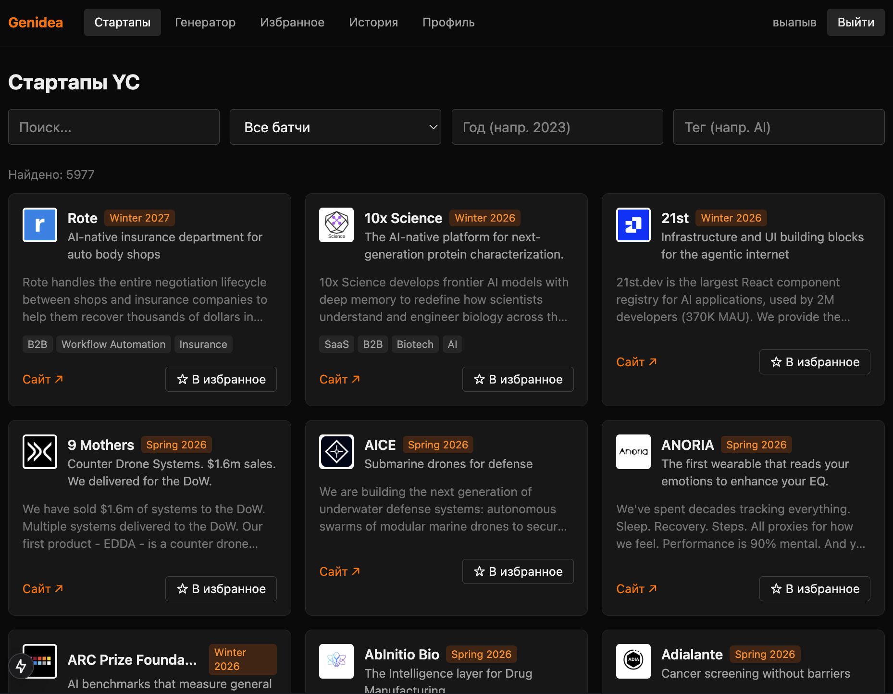
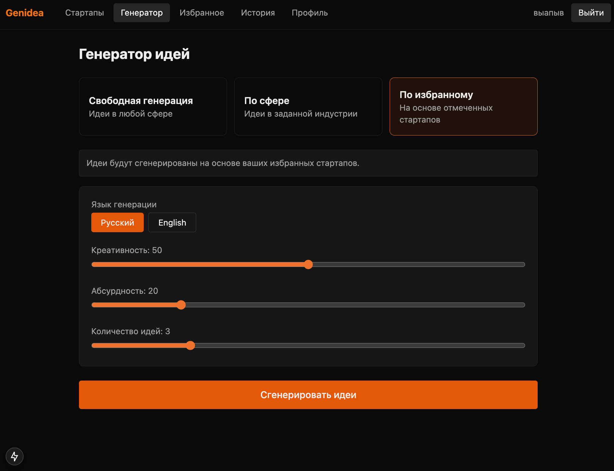

# Genidea

Веб-приложение для исследования стартапов Y Combinator и генерации новых
стартап-идей с помощью ИИ (OpenRouter).


## Возможности

- **Каталог стартапов** — ~6000 компаний YC (парсинг через публичный Algolia-индекс)
  с фильтрами по поиску, батчу, году и тегам.
- **Избранное** — отмечайте интересные стартапы.
- **Генератор идей** (3 режима):
  - **C — Свободная** генерация в любой сфере.
  - **D — По сфере** — задаёте индустрию.
  - **B — По избранному** — идеи на основе отмеченных стартапов.
- **Слайдеры** креативности и абсурдности (влияют на temperature LLM и промпт).
- **Аутентификация** — регистрация/вход по username, JWT в httpOnly cookie.
- **Персонализация** — профиль с дефолтными настройками + история идей.

## Стек

- **Backend**: FastAPI, SQLAlchemy, SQLite
- **Frontend**: Next.js (App Router), TypeScript, Tailwind CSS v4
- **LLM**: OpenRouter (`nvidia/nemotron-3-super-120b-a12b:free`)

## Настройка

Создайте `.env` в корне проекта:

```
OPENROUTER_API_KEY=ваш_ключ_openrouter
```

(`JWT_SECRET` тоже стоит задать в `.env` для продакшена.)

## Запуск backend

```bash
cd backend
python -m venv .venv          # создать изолированное окружение
source .venv/bin/activate     # активировать (Windows: .venv\Scripts\activate)
pip install -r requirements.txt
python -m app.seed            # один раз: загрузить стартапы YC в БД
uvicorn app.main:app --reload --port 8000
```

> **Важно:** используйте отдельное виртуальное окружение, а не базовое
> окружение conda — иначе несовместимые версии пакетов (например, `starlette`)
> приведут к ошибкам при запуске. Перед каждым запуском активируйте окружение
> командой `source .venv/bin/activate`.

## Запуск frontend

```bash
cd frontend
npm install
npm run dev               # http://localhost:3000
```

`frontend/.env.local`:

```
NEXT_PUBLIC_API_BASE=http://localhost:8000
```

## Обновление данных YC

```bash
cd backend
python -m app.seed
```

Скрипт заново тянет все батчи и обновляет/добавляет записи.
